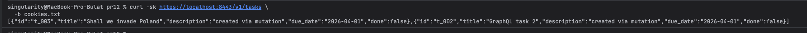
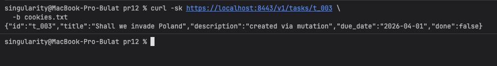
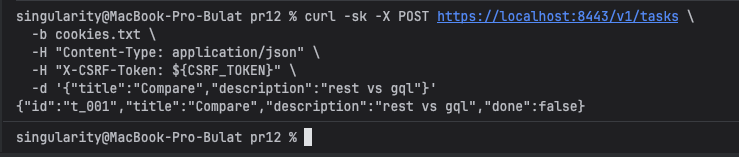
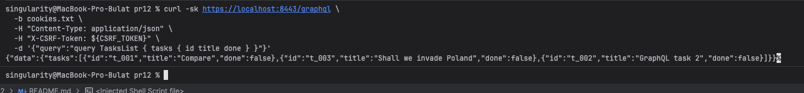
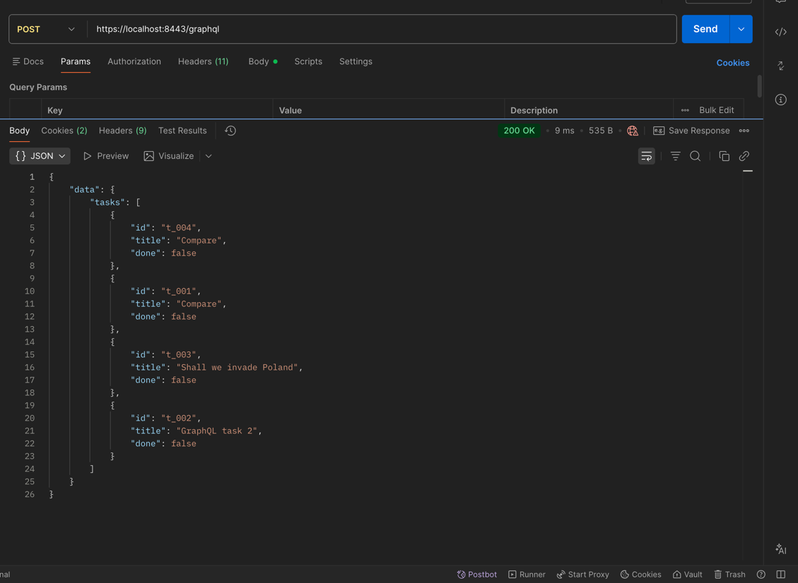
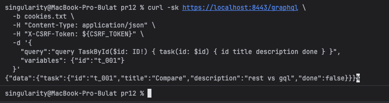
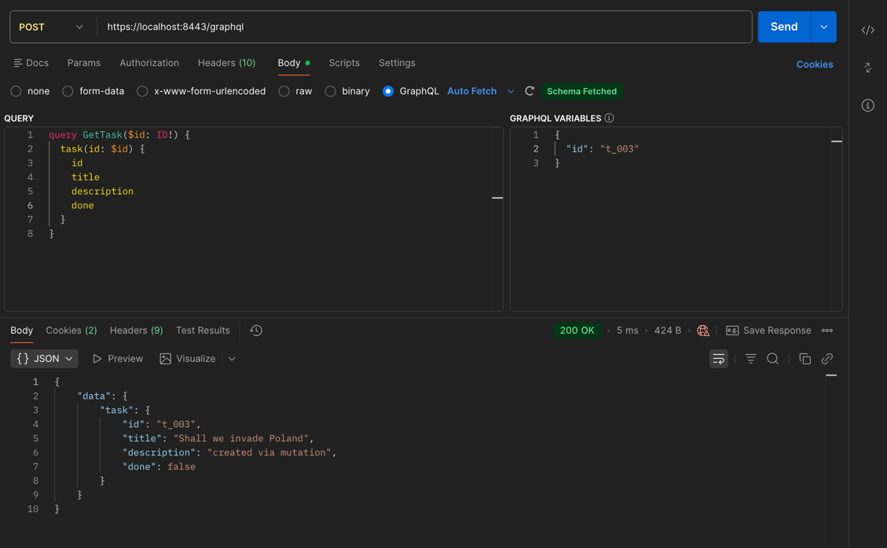
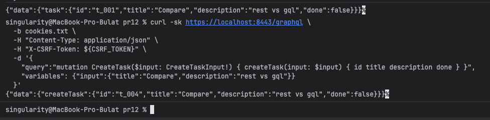
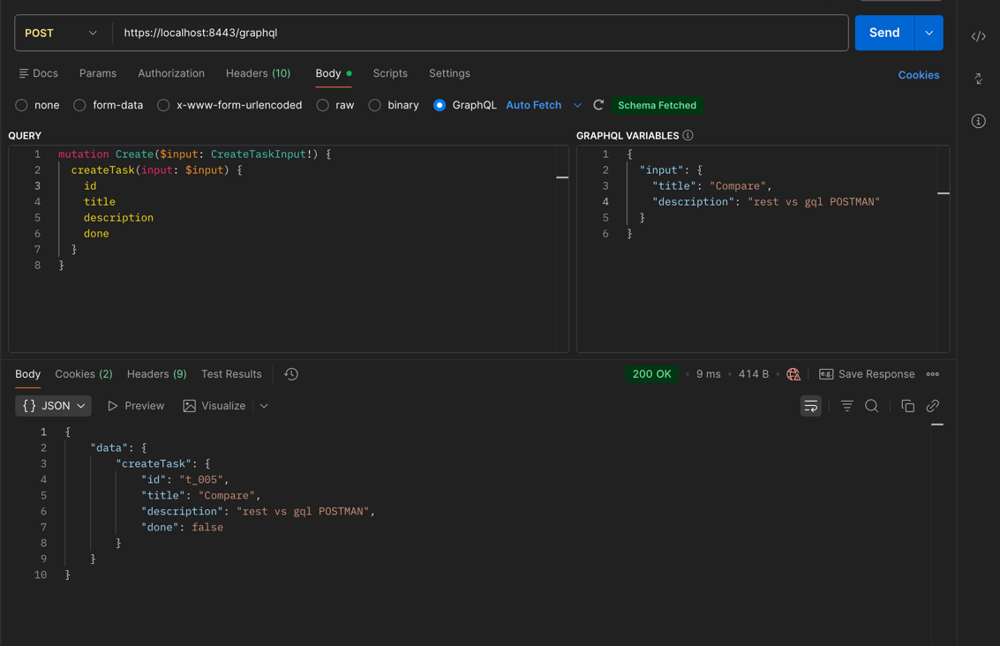

# Практическое занятие №12
# Саттаров Булат Рамилевич ЭФМО-01-25
# Сравнение REST и GraphQL: разработка одного и того же функционала двумя способами

## Запуск
```bash
cd deploy
cp .env.example .env
docker compose up -d --build
```

## 1. Выбор одного и того же функционала
Выбран сценарий **«Экран списка + карточка детали + действие create»**.

### 1.1. Экран списка (нужные поля)
- `id`
- `title`
- `done`

### 1.2. Экран деталей (нужные поля)
- `id`
- `title`
- `description`
- `done`

### 1.3. Действие
- Создание задачи: `createTask` / `POST /v1/tasks`.

## 2. Как устроены запросы в этом проекте 

Базовый URL: **nginx на `https://localhost:8443`**.

Маршрутизация:
- `/v1/auth/*` -> сервис `auth`.
- `/v1/tasks*` -> сервис `tasks`
- `/graphql` -> сервис `graphql`.
- `/playground` -> GraphQL Playground.

### 2.1. Обязательные условия для запросов
- TLS self-signed: в `curl` нужен флаг `-k`.
- Авторизация для `tasks` и `graphql`: cookie `session=demo-session`.
- Для любого `POST/PATCH/DELETE` нужен CSRF:
  - cookie `csrf_token`
  - заголовок `X-CSRF-Token` с тем же значением.
- Это значит, что GraphQL `query` через `POST /graphql` тоже требует `X-CSRF-Token`.

### 2.2. Получение cookie и CSRF-токена
```bash
# 1) логин и сохранение cookie
curl -sk -c cookies.txt -X POST https://localhost:8443/v1/auth/login \
  -H "Content-Type: application/json" \
  -d '{"username":"student","password":"student"}'

# 2) достать csrf_token из cookie-файла
CSRF_TOKEN=$(awk '$6=="csrf_token" {print $7}' cookies.txt | tail -1)
```

## 3. Реализация сценария через REST
Базовый URL: `https://localhost:8443`

### 3.1. Список
```bash
curl -sk https://localhost:8443/v1/tasks \
  -b cookies.txt
```



### 3.2. Детали
```bash
curl -sk https://localhost:8443/v1/tasks/t_001 \
  -b cookies.txt
```


### 3.3. Действие (создать)
```bash
curl -sk -X POST https://localhost:8443/v1/tasks \
  -b cookies.txt \
  -H "Content-Type: application/json" \
  -H "X-CSRF-Token: ${CSRF_TOKEN}" \
  -d '{"title":"Compare","description":"rest vs gql"}'
```



## 4. Реализация сценария через GraphQL
Базовый URL: `https://localhost:8443/graphql`

### 4.1. Список
```graphql
query TasksList {
  tasks {
    id
    title
    done
  }
}
```

Пример HTTP вызова:
```bash
curl -sk https://localhost:8443/graphql \
  -b cookies.txt \
  -H "Content-Type: application/json" \
  -H "X-CSRF-Token: ${CSRF_TOKEN}" \
  -d '{"query":"query TasksList { tasks { id title done } }"}'
```



## Или через Postman



### 4.2. Детали
```graphql
query TaskById($id: ID!) {
  task(id: $id) {
    id
    title
    description
    done
  }
}
```

`variables`:
```json
{
  "id": "t_001"
}
```

Пример HTTP вызова:
```bash
curl -sk https://localhost:8443/graphql \
  -b cookies.txt \
  -H "Content-Type: application/json" \
  -H "X-CSRF-Token: ${CSRF_TOKEN}" \
  -d '{
    "query":"query TaskById($id: ID!) { task(id: $id) { id title description done } }",
    "variables": {"id":"t_001"}
  }'
```



## Через Postman



### 4.3. Действие (mutation create)
```graphql
mutation CreateTask($input: CreateTaskInput!) {
  createTask(input: $input) {
    id
    title
    description
    done
  }
}
```

`variables`:
```json
{
  "input": {
    "title": "Compare",
    "description": "rest vs gql"
  }
}
```

Пример HTTP вызова:
```bash
curl -sk https://localhost:8443/graphql \
  -b cookies.txt \
  -H "Content-Type: application/json" \
  -H "X-CSRF-Token: ${CSRF_TOKEN}" \
  -d '{
    "query":"mutation CreateTask($input: CreateTaskInput!) { createTask(input: $input) { id title description done } }",
    "variables": {"input":{"title":"Compare","description":"rest vs gql"}}
  }'
```



## Также в Postman




## 5. Что именно сравниваем

### 5.1. Количество запросов
- REST для сценария: `GET /v1/tasks` + `GET /v1/tasks/{id}` + `POST /v1/tasks` = **3 запроса**.
- GraphQL для сценария: `query tasks` + `query task(id)` + `mutation createTask` = **3 запроса**.

### 5.2. Объём данных
- REST возвращает фиксированную структуру ответа endpoint.
- GraphQL возвращает только явно запрошенные поля.

Простой способ сравнения:
```bash
curl -sk ... > rest_list.json
curl -sk ... > gql_list.json
wc -c rest_list.json gql_list.json
```

### 5.3. Ошибки и статусы
- REST: ошибки обычно выражаются HTTP-статусом (`400/404/500`) + текст/JSON.
- GraphQL: ошибки часто приходят в `errors` (обычно при HTTP `200`, но auth/csrf middleware может вернуть `401/403`).

### 5.4. Кэширование (концептуально)
- REST: проще кэшировать по URL/методу.
- GraphQL: один endpoint, нужен более сложный подход (persisted queries, normalized cache).

### 5.5. Таблица сравнения

| Критерий | REST | GraphQL |
|---|---|---|
| Число запросов в выбранном сценарии | 3 | 3 |
| Объём данных | Фиксированный ответ endpoint | Точная выборка нужных полей |
| Обработка ошибок | HTTP-статусы + тело ошибки | `errors` в GraphQL + возможные `401/403` от middleware |
| Кэширование | Простое HTTP-кэширование по URL | Сложнее, нужны доп. стратегии |

### 5.6. Итоговый вывод
Для сценария «список + детали + создание» REST и GraphQL дают одинаковое число запросов. REST проще в эксплуатации: понятные URL, HTTP-статусы, кэширование и мониторинг. 

GraphQL выигрывает в гибкости клиента: можно запрашивать только нужные поля и уменьшать объём трафика на сложных экранах. Если API стабилен и сценарии типовые, REST чаще удобнее. Если интерфейсы часто меняются и важна точная форма ответа, GraphQL обычно оправдан.

